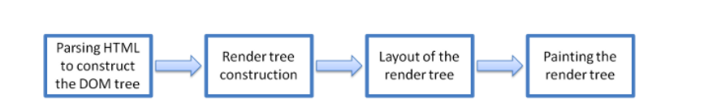

# internet hoạt động như thế nào 
**Một số khái niệm cần biết:**

-Internet là gì? Internet mạng lưới một mạng lưới toàn cầu gồm các máy tính được kết nối với nhau và giao tiếp thông qua một bộ giao thức được tiêu chuẩn hóa.

-địa chỉ ip là địa chỉ của các thiết bị trên internet mỗi thiết bị sẽ có 1 địa chỉ ip.

-DNS (Domain Name System) là hệ thống phân giải tên miền nó giống như danh bạ điện thoại mỗi tên miền đại diện cho 1 dịa chỉ ip

**Thông tin được truyền như thế nào trên internet**

 Khi bạn truy cập một trang web ví dụ youtube.com thì tên miền youtube.com sẽ được gửi tới máy chủ DNS để tìm địa chỉ ip của nó. Sau khi tìm được địa chỉ ip sẽ được gửi về trình duyệt và sau đó trình duyệt đi đến địa chỉ ip đó và đi đến trung tâm dữ liệu để lấy trang web mà bạn yêu cầu. Trang web này sẽ được gửi đến bạn đưới dạng nhị phân thông qua cáp quang rồi đến router sau đó là thiết bị của bạn

# http là gì???
Http (hyper text Transfer Protocol) là giao thức chịu trách nhiệm liên lạc giữa máy chủ vào máy khách

Http là không có trạng thái nghĩa là mỗi request là hoàn toàn độc lập

Https (hyper text Transfer Protocol Secure) là phiên bản bảo mật hơn của http mọi dữ liệu gửi đều được mã hóa 

# Http methods:

-GET: lấy data từ sever

-POST: gửi data đến sever 

-PUT: cập nhật data trên sever

-DELETE: xóa data ở trên sever

# http header fields

**-General:**

+Request URL

+Request Method

+Status Code

+Remote Address

+Referrer Policy

**-Response:**

+Sever

+Set-cookie

+Content Type

+Content Length

+Date 

**-Request:**

+Cookies

+Accept-xxx

+Content Type

+Content Length

+Authorization

+User Agent

+Referrer

# Http status code

1xx: Informational

2xx: Success

3xx: Redirect

4xx: client Error

5xx: Server Error

# web hosting là gì??

Web hosting là nơi lưu trữ toàn bộ trang web của bạn, nó sẽ giúp các trang web có thể truy cập được bằng internet

**các loại web hosting**

- Shared hosting: đơn giản là website của bạn sẽ được lưu trữ cùng với rất nhiều website khác, do đó chi phí bỏ ra khá là rẻ. Tuy nhiên, tài nguyên là 1 vấn đề vì website của bạn phải chia sẻ với nhiều website khác

- VPS hosting(virual private server) là máy chủ riêng ảo nhưng chia sẻ chung phần cứng vật lý với các máy chủ ảo khác, về cơ bản khi sử dụng dịch vụ này thì bạn sẽ được cung cấp X RAM, X CPU của riêng bạn không dung chung với bất cử máy chủ riêng ảo nào khác

- Dedicated Server: là máy chủ vật lý riêng của bạn 

**phân biệt web page, website, web server, search engine**

- Web page là tài liệu đơn giản được hiển thị bằng trình duyệt. Các tài liệu này thường được viết bằng html

- Website là tập hợp các web page được liên kết có chung tên miền duy nhất

- Web server là máy lưu trữ 1 hoặc nhiều trang web khác nhau.

- Search engines là trang web đặc biệt giúp người dùng tìm kiếm những trang web khác

# Web Browser

Web Browser là 1 phần mềm cho phép người dùng truy cập hoặc hiển thị các trang web thông qua giao diện đồ họa của nó 

Thành phần của Web Browser:

- User Interface: User Interface giúp người dùng cuối tương tác với các yếu tố trưc quan có sẵn trên trang web ví dụ như: nút home, nút next, thanh địa chỉ...

- Browser Engine: Browser Engine là phần trung gian giữa User Interface và  Rendering Engine. Nó truy vấn và xử lý  Rendering Engine theo thông tin nhận được từ User Interface. Hiệu suất và tính năng của Browser Engine ảnh hưởng lớn đến trải nhiện duyện web của người dùng

- Rendering Engine: Rendering Engine sẽ hiển thị trang web cụ thể được yêu cầu bởi người dùng. Tất cả Web Browser đều có  Rendering Engine riêng và chúng cũng có thể khác nhau với các phiên bản khác nhau của trình duyện 

- Networking: Networking chịu trách nhiệm quản lý các yêu cầu bằng giao thức tiêu chuẩn như http or ftp

- JavaScript Interpreter: JavaScript Interpreter chịu trách nhiệm phân tích và thực thi mã javaScript được nhúng trong trang web

- UI backend: UI backend sử dụng các phương thức giao diện người dùng của hệ điều hành cơ bản. Nó chủ yếu được sử dụng để vẽ các vật dụng cơ bản

- Data Storage/Persistence: Trình duyệt web cần lưu trữ cục bộ nhiều loại dữ liệu khác nhau, ví dụ: cookie. Do đó, các trình duyệt phải tương thích với các cơ chế lưu trữ dữ liệu như WebSQL, IndexedDB, FileSystem, v.v.

**basic render flow**

- Trang HTML được yêu cầu được phân tích cú pháp theo từng đoạn, bao gồm các tệp CSS bên ngoài và các phần tử kiểu, bởi công cụ kết xuất. Sau đó, các phần tử HTML được chuyển đổi thành các nút DOM để tạo thành “cây nội dung” hoặc “cây DOM”.

- Đồng thời, trình duyệt cũng tạo cây kết xuất. Cây này bao gồm cả thông tin về kiểu dáng cũng như hướng dẫn trực quan xác định thứ tự các phần tử sẽ được hiển thị. Cây kết xuất đảm bảo rằng nội dung được hiển thị theo thứ tự mong muốn.

- Hơn nữa, cây kết xuất sẽ trải qua quá trình bố cục. Khi cây hiển thị được tạo, giá trị vị trí hoặc kích thước không được chỉ định. Toàn bộ quá trình tính toán các giá trị để đánh giá vị trí mong muốn được gọi là quy trình bố trí. Trong quá trình này, mỗi nút được gán tọa độ chính xác. Điều này đảm bảo rằng mọi nút xuất hiện ở vị trí chính xác trên màn hình.

- Bước cuối cùng là vẽ màn hình, trong đó cây kết xuất được duyệt qua và phương thức Paint() của trình kết xuất được gọi, phương thức này sẽ vẽ từng nút trên màn hình bằng cách sử dụng lớp phụ trợ giao diện người dùng.

# GIT

git là hệ thống kiểm soát phiên bản phổ biến trên thế giới 

git đươc sử dụng cho:
- kiểm tra sự thay đổi mã

- kiểm tra ai là người thực hiện sự thay đổi

- hợp tác mã 

git đươc sử dụng để:
 
- quản ký dự án với repo 

- sao chép dự án để làm việc trên 1 bản sao cục bộ

- điều khiển và theo dõi sự thay đổi với Staging and Committing

- Branch and Merge cho phép làm việc trên những phần và phiên bản khác nhau của dự án

- Pull lấy phiên bản mới nhất của dự án về bản sao cục bộ 

- push đẩy các bản cập nhật mới vào dự án chính

# một số lệnh phổ biến trong git 

git init: tạo kho lưu trữ rỗng 

git status: kiểm tra trạng thái git 

git add .: thêm tất cả các tệp có thay đổi vào môi trường trạng thái

git commit + message: lấy các tệp trong môi trường trạng thái chuyển vào kho lưu trư cục bộ 

git push: đẩy kho lưu trữ cục bộ lên kho lưu trữ từ xa

git pull: lấy phiên bản mới nhất của dự án về bản sao cục bộ

git clone: sao chép 1 kho lưu trữ từ xa và lưu vào folder mà bạn chọn

git branch + tên nhánh: tạo 1 nhánh mới 

git checkout + tên nhánh: chuyển đến nhánh được chỉ định

